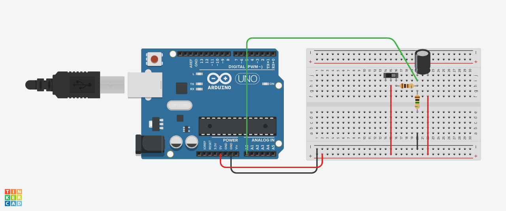
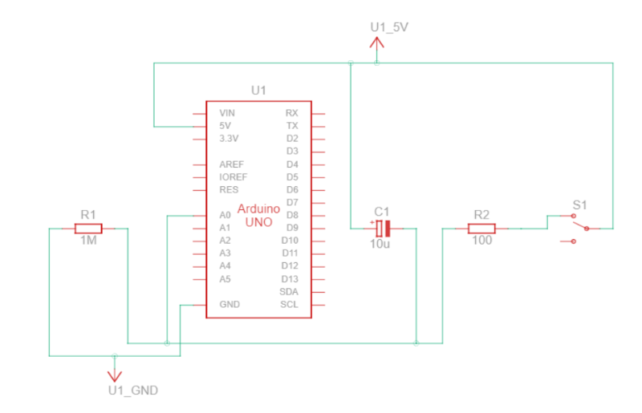

# relatorio_circuito_resistor_capacitor
Simulação e análise de circuito RC com filtragem, entrada por botão e saída em LEDs.

## Diagrama elétrico e Circuito

<p align="center">
  <figure style="display:inline-block; margin: 10px;">
    
    <figcaption><em>Figura 1 - Protótipo do circuito no Tinkercad</em></figcaption>
  </figure>
  <figure style="display:inline-block; margin: 10px;">
    
    <figcaption><em>Figura 2 - Diagrama fornecido na atividade</em></figcaption>
  </figure>
</p>


## Análise do circuito com gráficos

Para acessar o notebook [clique aqui](https://github.com/deborangueira/relatorio_circuito_resistor_capacitor/blob/811152a36af3321862d3f7ba4a1e1637a12d664b/src/analise_rc.ipynb).

## Código

```P
int pinoNoRC=0; 
int valorLido = 0;
float tensaoCapacitor = 0, tensaoResistor;
unsigned long time; 

void setup(){ 
Serial.begin(9600); 
} 

void loop() { 
	time=millis(); 
	valorLido=analogRead(pinoNoRC); 
	tensaoResistor=(valorLido*5.0/1023); // 5.0V / 1023 degraus = 0.0048876 
	tensaoCapacitor = abs(5.0-tensaoResistor);
 	Serial.print(time); //imprime o conteúdo de time no MONITOR SERIAL
    Serial.print(" "); 
  	Serial.print(tensaoResistor);
  	Serial.print(" ");
  	Serial.println(tensaoCapacitor); 
	delay(400); 
}

# Gráficos

### Carga no capacitor
### Carga no resistor
### Comparação carga no capacitor e resistor


```
